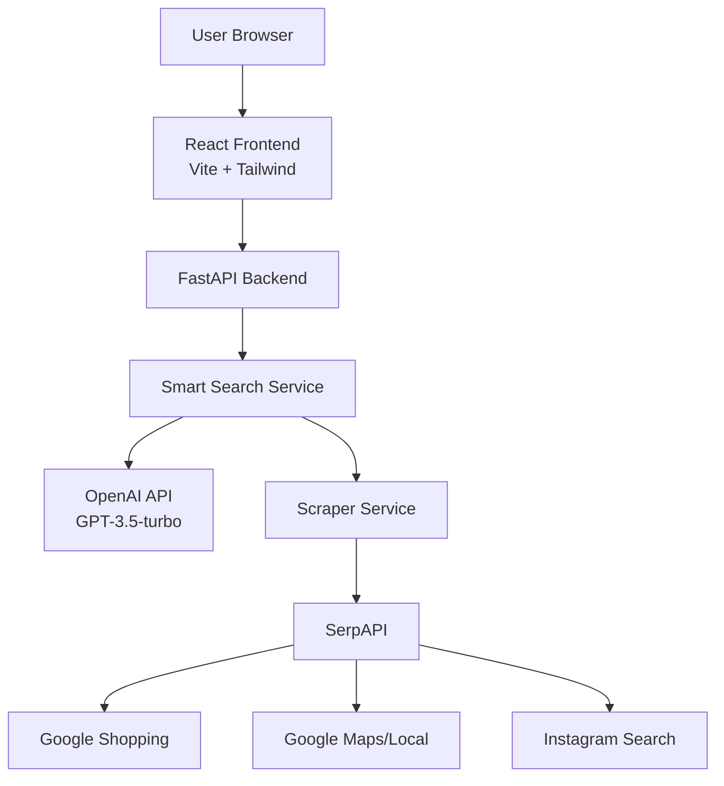
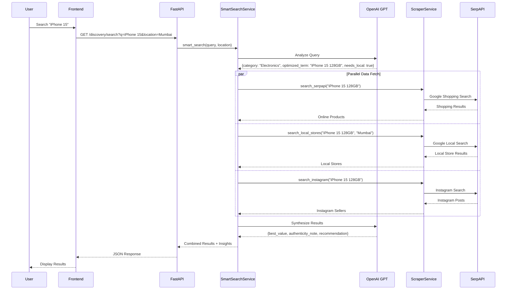
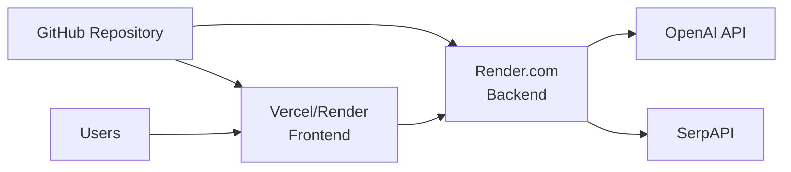

# KitneKa - System Design Document

## 1. Project Overview

**KitneKa** is an intelligent price discovery platform for India that helps users find the best deals across online retailers, local stores, and Instagram sellers. The name "KitneKa" (Hindi for "How much?") reflects the bargaining culture in Indian markets.

### Core Value Proposition
- **Smart Search**: AI-powered query analysis using OpenAI GPT
- **Multi-Channel Discovery**: Online e-commerce, local stores, and Instagram sellers
- **Price Intelligence**: Automated price extraction and comparison
- **Authenticity Guidance**: LLM-generated tips for verifying product authenticity

---

## 2. Architecture

### High-Level Architecture



### Components

#### Frontend (React + Vite)
- **Framework**: React 18 with Vite build tool
- **Styling**: Tailwind CSS v3
- **State Management**: React useState hooks
- **HTTP Client**: Axios
- **Icons**: Lucide React

#### Backend (Python FastAPI)
- **Framework**: FastAPI 0.109
- **Server**: Uvicorn (ASGI)
- **AI/ML**: OpenAI Python SDK
- **Search**: SerpAPI (Google Search Results API)
- **Database**: SQLite (for price tracking feature)

---

## 3. System Design

### 3.1 Smart Search Flow



### 3.2 Data Models

#### Search Response Schema
```json
{
  "analysis": {
    "category": "Electronics",
    "optimized_term": "iPhone 15 128GB",
    "needs_local": true
  },
  "results": {
    "online": [/* Product[] */],
    "local": [/* Store[] */],
    "instagram": [/* Post[] */]
  },
  "insight": {
    "best_value": {
      "title": "iPhone 15 128GB",
      "price": 79999,
      "reason": "Lowest verified price"
    },
    "authenticity_note": "Check IMEI number...",
    "recommendation_text": "Best deal found on Flipkart..."
  }
}
```

#### Product Schema (Online)
```python
{
    "id": str,
    "source": str,  # "Amazon", "Flipkart"
    "title": str,
    "price": float,
    "url": str,
    "image": str,
    "rating": float,
    "reviews": int,
    "delivery": str
}
```

#### Store Schema (Local)
```python
{
    "id": str,
    "source": str,  # Store name
    "title": str,  # Product name
    "price": float,
    "distance": str,  # "2.5 km"
    "address": str,
    "rating": float,
    "reviews": int
}
```

#### Post Schema (Instagram)
```python
{
    "id": str,
    "username": str,
    "profile_url": str,
    "post_url": str,
    "caption": str,
    "image": str,
    "price": float,  # Extracted via regex
    "likes": int,
    "comments": int
}
```

---

## 4. API Endpoints

### Discovery API

#### `GET /discovery/search`
Search for products across all channels.

**Query Parameters:**
- `q` (required): Search query
- `location` (optional): City name (default: "Mumbai")

**Response:** `SearchResponse` (see schema above)

---

### Price Tracking API (Future Enhancement)

#### `POST /discovery/track`
Start tracking a product's price.

**Request Body:**
```json
{
  "name": "iPhone 15 128GB",
  "price": 79999,
  "image": "https://...",
  "competitors": [
    {"name": "Amazon", "url": "...", "price": 81999},
    {"name": "Flipkart", "url": "...", "price": 80499}
  ]
}
```

---

## 5. Key Features

### 5.1 AI-Powered Query Analysis
- **Technology**: OpenAI GPT-3.5-turbo with JSON mode
- **Purpose**: 
  - Categorize products (Electronics, Fashion, etc.)
  - Optimize search terms for better results
  - Determine if local search is relevant

### 5.2 Price Extraction (Instagram)
**Regex Pattern**: `[₹Rs\.\s]*(\d+(?:,\d+)*)`

**Examples:**
- "Handmade bag ₹2500 DM to buy" → 2500
- "Rs.1,50,000 negotiable" → 150000
- "Beautiful saree 3000/-" → 3000

### 5.3 Store Filtering (Online Tab)
- Client-side filtering by store name
- Checkbox UI with custom styling
- Preserves "Best Price" badge when no filters applied

---

## 6. Technology Stack

### Frontend
| Technology | Version | Purpose |
|------------|---------|---------|
| React | 18.x | UI Framework |
| Vite | 7.x | Build Tool |
| Tailwind CSS | 3.x | Styling |
| Axios | Latest | HTTP Client |
| Lucide React | Latest | Icons |

### Backend
| Technology | Version | Purpose |
|------------|---------|---------|
| Python | 3.11 | Runtime |
| FastAPI | 0.109 | Web Framework |
| Uvicorn | 0.27 | ASGI Server |
| OpenAI | 2.9 | LLM Integration |
| SerpAPI | 2.4 | Search Results |
| SQLAlchemy | 2.0 | ORM (for tracking) |

---

## 7. Deployment Architecture



### Environment Variables

**Backend (Render):**
- `OPENAI_API_KEY`: OpenAI API key
- `SERPAPI_API_KEY`: SerpAPI key
- `PYTHON_VERSION`: 3.11.0

**Frontend (Vercel/Render):**
- `VITE_API_URL`: Backend URL (e.g., `https://kitneka.onrender.com`)

---

## 8. Security Considerations

1. **API Keys**: Stored as environment variables, never committed to Git
2. **CORS**: Configured to allow specific frontend origins
3. **GitHub Secret Scanning**: Blocks commits containing exposed secrets
4. **Rate Limiting**: SerpAPI has built-in rate limits

---

## 9. Future Enhancements

1. **Price History Tracking**: Chart showing price trends over time
2. **User Accounts**: Save searches and set price alerts
3. **Browser Extension**: Quick price check from any website
4. **Mobile App**: React Native version
5. **Seller Verification**: Badge system for trusted Instagram sellers
6. **Bulk Search**: Upload CSV to compare multiple products
