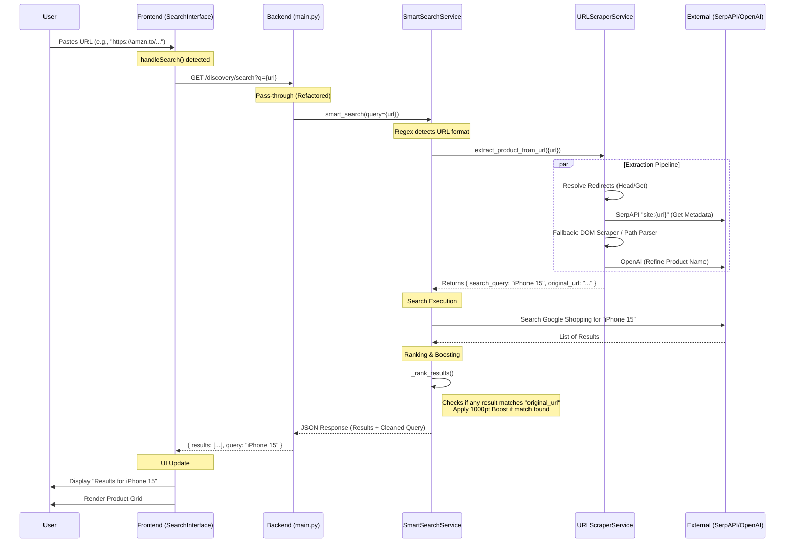

# URL Search Architecture & Flow

This document outlines the complete lifecycle of a URL search request in KitneKa, from the user's keystroke to the final results display.

## High-Level Flow

## Simple English Breakdown 🧠

Here is the step-by-step story of what happens when you search for a URL.

### 1. The Messenger (Frontend)
**"I take your message."**
*   **Action**: You paste `https://amzn.to/3xyz` into the search bar.
*   **Logic**: The frontend sees it's a URL but **does not** touch it. It sends the exact text to the backend.
*   **Display**: It waits. When the backend replies "This is a Sony Headphone," the frontend updates the header to say *"Results for Sony Headphone"* (instead of showing the ugly link).

### 2. The Detective (URL Scraper Service)
**"I find out who this is."**
This component has a new "Smart Pipeline" to identify the product efficiently:
1.  **Un-masking**: It follows redirects to turn short links (`amzn.to`) into real links (`amazon.in/dp/B0...`).
2.  **The Quick Peek (Metadata)**: Before doing anything heavy, it quickly grabs the page's hidden "ID Card" (HTML Metadata & JSON-LD).
    *   *Found a Canonical URL?* Great, save it.
    *   *Found a Product Name?* Done.
3.  **ID Check**: It looks at the URL for a fingerprint, like an Amazon ASIN (`B085...`). If found, this is the strongest proof of identity.
4.  **The Deep Search**: Only if the above fail, it asks Google (SerpAPI) or scans the URL text itself.

### 3. The Manager (Smart Search Service)
**"I organize it all."**
*   **Action**: It takes the *Product Name* found by the Detective and searches Google Shopping.
*   **Goal**: Get a list of 10-20 "Candidate Products".
*   **Normalization**: It cleans the URLs (removes `?ref=...`, cleans `www.`) so they can be compared fairly.

### 4. The Judge (Ranking Logic)
**"I decide the winner."**
It scores the candidates to ensure the *exact* item you pasted is #1.
*   **Rule #1: The ID Match (+1500 Points)** 🥇
    *   If the Detective found ID `B0XYZ` and a search result has `B0XYZ`, it wins immediately.
*   **Rule #2: The Official Link Match (+1200 Points)** 🥈
    *   If the "Official Canonical URL" matches the result's URL, it wins.
*   **Rule #3: The Fuzzy Match (+800 Points)** 🥉
    *   If the URLs look mostly the same (ignoring tracking codes), it gets a big boost.
*   **Rule #4: Text Match**
    *   Otherwise, we rank by Brand and Name similarity.

---

## Real World Trace: Amazon Shoe Example 👟

**Input URL**:
`https://www.amazon.in/BRUTON-Sport-Shoes-Running-White/dp/B0F2THXY4T?source=ps-sl-shoppingads-lpcontext&ref_=fplfs&smid=A22K40KEJWHSL8&th=1&psc=1`

### Step 1: Frontend
*   User pastes link.
*   Frontend displays *Loading...* and sends URL to Backend.

### Step 2: The Detective (Extraction)
*   **Redirects**: None (it's a full link).
*   **ID Check**:
    *   **Extracted Product ID**: `{"type": "asin", "value": "B0F2THXY4T"}` 🎯
*   **Source**:
    *   Scraper tries to fetch HTML (blocked by Amazon 🚫).
    *   **Fallback to Path Parsing**: Reads URL text `/BRUTON-Sport-Shoes-Running-White...`
    *   **Extracted Text**: "BRUTON Sport Shoes Running White"

### Step 3: The Polisher (AI Refinement) 🤖
*   **Input**: "BRUTON Sport Shoes Running White"
*   **Action**: AI removes "Running White" (SEO filler).
*   **Clean Output**: "BRUTON Sport Shoes"

### Step 4: The Manager (Search)
*   **Action**: Searches Google Shopping for `BRUTON Sport Shoes`.
*   **Discovery**: Because we search for the *Name* (not the link), we find the same shoe across the web.
*   **Results Found**:
    *   Result A (Flipkart): "Bruton Running Shoe Blue"
    *   Result B (Amazon): "BRUTON Sport Shoe... B0F2..."
    *   Result C (Myntra): "Bruton Gym Wear..."

### Step 5: The Judge (Ranking)
The Ranker loops through the results:

1.  **Checking Result A (Flipkart)**:
    *   ID Match? **No** (Flipkart URLs don't have Amazon ASINs).
    *   Text Match? **Yes**.
        *   Brand "Bruton" matches (+50).
        *   Phrase "Sport Shoes" matches (+200).
    *   **Total Score: 250 (Strong Alternative)** 🥈
    *   *Result*: This appears just below the pinned item.

2.  **Checking Result B (Amazon)**:
    *   **ID Match? YES!** Link contains `B0F2THXY4T`.
    *   **Action**: Apply **+1500 Points**.
    *   **Total Score: 1750 (Winner)** 🏆
    *   *Result*: Pinned to #1.

### Final Outcome
*   **#1**: The Exact Amazon Item (Verified via ID).
*   **#2, #3**: The same shoe on Flipkart/Myntra (Verified via Text Match).
*   **#10+**: Unrelated shoes.

---

## Trace 2: Myntra Watch Example ⌚

**Input URL**:
`https://www.myntra.com/watches/michael+kors/michael-kors-women-embellished-harlowe-analogue-watch-mk4710/22142168/buy`

This example demonstrates **Fuzzy Path Matching** (finding the link even if `/buy` is missing) and **Model Matching** (finding the watch on other sites).

### Step 1: Extraction & Normalization
*   **Normalization**:
    *   Host: `myntra.com` (stripped `www`)
    *   Path: `/watches/michael+kors/michael-kors...mk4710/22142168/buy`
    *   Query: (Empty)
*   **Extraction**:
    *   **ID**: `None` (Our extractor currently targets Amazon ASINs).
    *   **Path Text**: "Michael Kors Women Embellished Harlowe Analogue Watch Mk4710"
    *   **Refined Query**: "Michael Kors Women Embellished Watch MK4710"

### Step 2: The Manager (Search)
*   Searches Google Shopping for: "Michael Kors Women Embellished Watch MK4710"

### Step 3: The Judge (Ranking)
The Ranker finds results and matches them:

1.  **Result A (Myntra Result)**:
    *   **URL**: `https://www.myntra.com/watches/michael+kors/michael-kors-women...mk4710/22142168` (Note: No `/buy` suffix).
    *   **ID Match**: No.
    *   **Canonical Match**: No (URLs differ by `/buy`).
    *   **Fuzzy Path Match? YES!**
        *   The input path ends with `/22142168/buy`.
        *   The result path ends with `/22142168`.
        *   Logic: `/buy` is a safe suffix difference.
        *   **Score**: **+800 Points** (High Boost). 🥉
    *   *Result*: Ranked near top (Pinned if confidence high).

2.  **Result B (Amazon/Ajio)**:
    *   **URL**: `https://www.amazon.in/.../MK4710`
    *   **ID Match**: No.
    *   **URL Match**: No.
    *   **Text Match**:
        *   Brand "Michael Kors" (+50).
        *   **Model "MK4710"** found in title (+500).
        *   Phrase Match (+200).
    *   **Score**: **~750 Points** (Strong Text Match).
    *   *Result*: shown as a top comparison option.

### Final Outcome
*   **#1**: The Myntra Link (captured via Fuzzy Path logic).
*   **#2**: Amazon/Ajio links (captured via Model Identification).

---

## Trace 3: Myntra Generic Path Fix (M.A.C Cream) 💄

**Input URL**:
`https://www.myntra.com/mailers/skin-care/m.a.c/m.a.c-mini-strobe-cream-15-ml---pinklite/12218208/buy`

This example shows how we handle generic path segments (`mailers`, `skin-care`) that used to pollute the search query.

### Step 1: Extraction (Path Parsing)
*   **Raw Path**: `/mailers/skin-care/m.a.c/m.a.c-mini-strobe-cream...`
*   **Old Logic**: Extracted "Mailers Skin Care M.A.C".
*   **New Logic**:
    *   Ignores: `mailers`, `skin-care`, `buy`.
    *   Extracts: **"M.A.C m.a.c mini strobe cream 15 ml pinklite"**
    *   **Refined Query**: **"M.A.C m.a.c mini strobe cream"** (First 5 words).

### Step 2: The Manager (Search)
*   Searches Google Shopping for: "M.A.C m.a.c mini strobe cream".
*   *Result*: Accurate product results found.

### Step 3: The Judge (Ranking)
*   **Myntra Result**: Found via **Fuzzy Path Match** (`/12218208` matches `/12218208/buy`). **(Score +800)**
*   **Nykaa/Amazon Results**: Found via **Text Match**.
