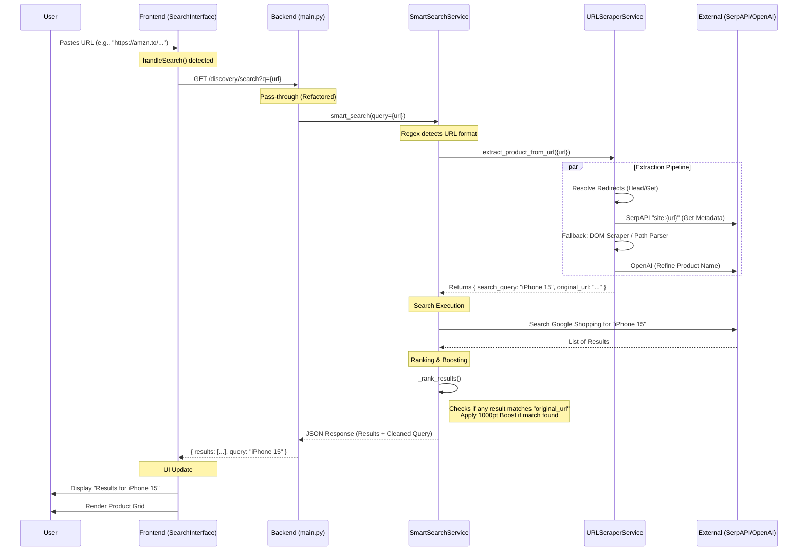

# URL Search Architecture & Flow

This document outlines the complete lifecycle of a URL search request in KitneKa, from the user's keystroke to the final results display.

## High-Level Flow

## Simple English Breakdown 🧠

Here is the step-by-step story of what happens when you search for a URL.

### 1. The Messenger (Frontend)
**"I take your message."**
*   **Action**: You paste `https://amzn.to/3xyz` into the search bar.
*   **Logic**: The frontend sees it's a URL but **does not** touch it. It sends the exact text to the backend.
*   **Display**: It waits. When the backend replies "This is a Sony Headphone," the frontend updates the header to say *"Results for Sony Headphone"* (instead of showing the ugly link).

### 2. The Detective (URL Scraper Service)
**"I find out who this is."**
This component has a new "Smart Pipeline" to identify the product efficiently:
1.  **Un-masking**: It follows redirects to turn short links (`amzn.to`) into real links (`amazon.in/dp/B0...`).
2.  **The Quick Peek (Metadata)**: Before doing anything heavy, it quickly grabs the page's hidden "ID Card" (HTML Metadata & JSON-LD).
    *   *Found a Canonical URL?* Great, save it.
    *   *Found a Product Name?* Done.
3.  **ID Check**: It looks at the URL for a fingerprint, like an Amazon ASIN (`B085...`). If found, this is the strongest proof of identity.
4.  **The Deep Search**: Only if the above fail, it asks Google (SerpAPI) or scans the URL text itself.

### 3. The Manager (Smart Search Service)
**"I organize it all."**
*   **Action**: It takes the *Product Name* found by the Detective and searches Google Shopping.
*   **Goal**: Get a list of 10-20 "Candidate Products".
*   **Normalization**: It cleans the URLs (removes `?ref=...`, cleans `www.`) so they can be compared fairly.

### 4. The Judge (Ranking Logic)
**"I decide the winner."**
It scores the candidates to ensure the *exact* item you pasted is #1.
*   **Rule #1: The ID Match (+1500 Points)** 🥇
    *   If the Detective found ID `B0XYZ` and a search result has `B0XYZ`, it wins immediately.
*   **Rule #2: The Official Link Match (+1200 Points)** 🥈
    *   If the "Official Canonical URL" matches the result's URL, it wins.
*   **Rule #3: The Fuzzy Match (+800 Points)** 🥉
    *   If the URLs look mostly the same (ignoring tracking codes), it gets a big boost.
*   **Rule #4: Text Match**
    *   Otherwise, we rank by Brand and Name similarity.

---

## Real World Trace: Amazon Shoe Example 👟

**Input URL**:
`https://www.amazon.in/BRUTON-Sport-Shoes-Running-White/dp/B0F2THXY4T?source=ps-sl-shoppingads-lpcontext&ref_=fplfs&smid=A22K40KEJWHSL8&th=1&psc=1`

### Step 1: Frontend
*   User pastes link.
*   Frontend displays *Loading...* and sends URL to Backend.

### Step 2: The Detective (Extraction)
*   **Redirects**: None (it's a full link).
*   **ID Check**:
    *   Scanner sees `/dp/B0F2THXY4T`.
    *   **Extracted Product ID**: `{"type": "asin", "value": "B0F2THXY4T"}` 🎯
*   **Metadata Extraction**:
    *   Fetches HTML.
    *   Finds Title: *"BRUTON Sport Shoes for Men..."*
    *   **Clean Name**: "BRUTON Sport Shoes"
*   **Normalization**:
    *   Strips `source=...`, `ref_=...`, `smid=...`.
    *   **Clean Key**: `amazon.in/bruton-sport-shoes-running-white/dp/b0f2thxy4t`

### Step 3: The Manager (Search)
*   Executes Google Shopping search for: `BRUTON Sport Shoes`.
*   Gets 20 Results.
    *   Result A: "Bruton Running Shoe" (Link: `flipkart.com/...`)
    *   Result B: "Bruton Sport Shoe" (Link: `amazon.in/BRUTON...dp/B0F2THXY4T...`)
    *   Result C: "Nike Shoe"

### Step 4: The Judge (Ranking)
The Ranker loops through the results:

1.  **Checking Result A (Flipkart)**:
    *   ID Match? No.
    *   Canonical Match? No.
    *   Text Match? Yes (Brand "Bruton"). **Score: 200**.

2.  **Checking Result B (Amazon)**:
    *   **ID Match? YES!** Link contains `B0F2THXY4T`.
    *   **Action**: Apply **+1500 Points**.
    *   **Total Score: 1750 (Winner)** 🏆

3.  **Checking Result C (Nike)**:
    *   Low score.

### Final Outcome
The frontend displays **Result B** (the exact shoe you pasted) at the very top of the list. ✅
