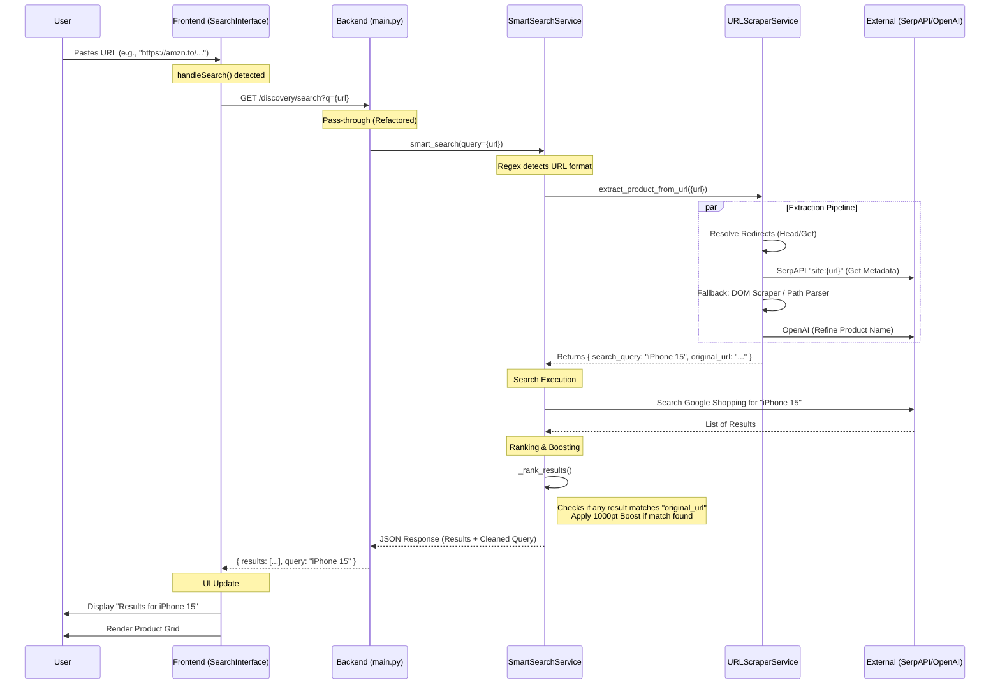

# URL Search Architecture & Flow

This document outlines the complete lifecycle of a URL search request in KitneKa, from the user's keystroke to the final results display.

## High-Level Flow

## Component Breakdown

### 1. Frontend (`SearchInterface.jsx`)
*   **Input Handling**: Captures the user's input. Even if it's a URL, it's sent to the `/discovery/search` endpoint.
*   **Visual Feedback**:
    *   Shows a loading spinner.
    *   Once results return, it looks at the `searchData.query` field from the backend.
    *   **Smart Header**: Instead of showing `Results for "https://..."`, it displays `Results for "Extracted Product Name"` to verify to the user that we understood the link.
*   **Rendering**: Displays the results in a grid. If the original URL product was found, it will likely be the first item due to ranking logic.

### 2. Backend Entry (`main.py`)
*   **Gateway**: Receives the request.
*   **Refactor Note**: We recently removed logic here that was "prematurely" extracting the name. Now, it passes the *raw URL* directly to the inner services so they have the full context.

### 3. Smart Search Service (`smart_search_service.py`)
The "Brain" of the operation.
*   **Detection**: Uses Regex to see if the query is a URL.
*   **Orchestration**:
    1.  Calls `URLScraperService` to turn the URL into a searchable "Product Name".
    2.  Uses that "Product Name" to search the web (Google Shopping).
    3.  **Critical Step - Ranking**: It compares the fresh search results against the `original_url`.
    *   *Match Found?* -> **Exact Match Boost** (Score += 1000). This guarantees the product you linked appears at the top.
    *   *No URL Match?* -> Ranks by text relevance (Brand match, Model match).

### 4. URL Scraper Service (`url_scraper_service.py`)
The "Investigator". Its job is to find out *what* the link is.
*   **Resolver**: Handles shortened links (e.g., `amzn.to`, `bit.ly`) by following redirects to the final retailer page.
*   **Strategy 1 (SerpAPI)**: Asks Google "What is on this specific page?". This is fast and accurate for metadata.
*   **Strategy 2 (Path Parsing)**: Reads the URL text itself (e.g., `amazon.in/Apple-iPhone-15...`) to guess the name.
*   **Strategy 3 (DOM Scraping)**: If other methods fail, it spawns a headless browser (Playwright) to visit the page and read the `<H1>` title tag.
*   **AI Refinement**: Sends the gathered messy text to OpenAI to get a clean, search-optimized string (e.g., converting "Apple-iPhone-15-Blue-128GB-Generic-Case" -> "Apple iPhone 15 Blue 128GB").

### 5. Data Flow Summary
1.  **Raw URL** (`https://...`) -> **Backend**
2.  **Backend** -> **Name Extraction** ("Michael Kors Bag")
3.  **Name** -> **Google Shopping Search**
4.  **Results** + **Original URL** -> **Ranking Engine**
5.  **Sorted Results** (Exact match first) -> **Frontend**
